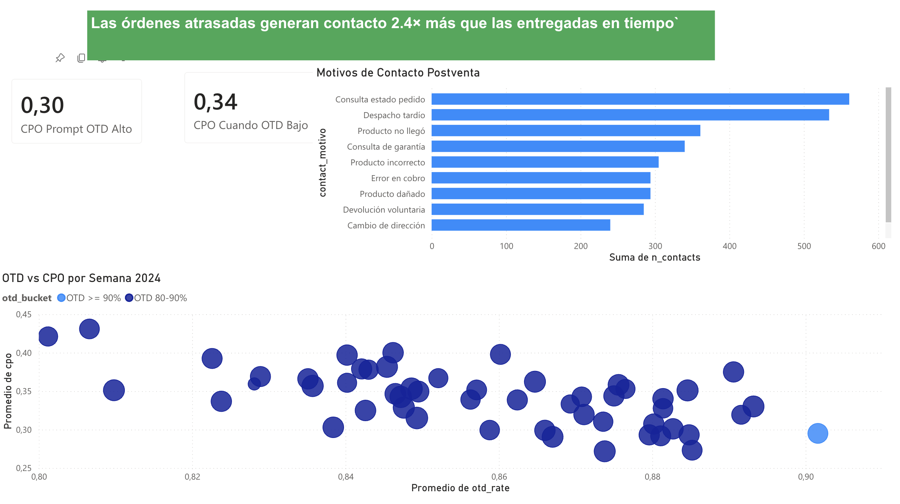
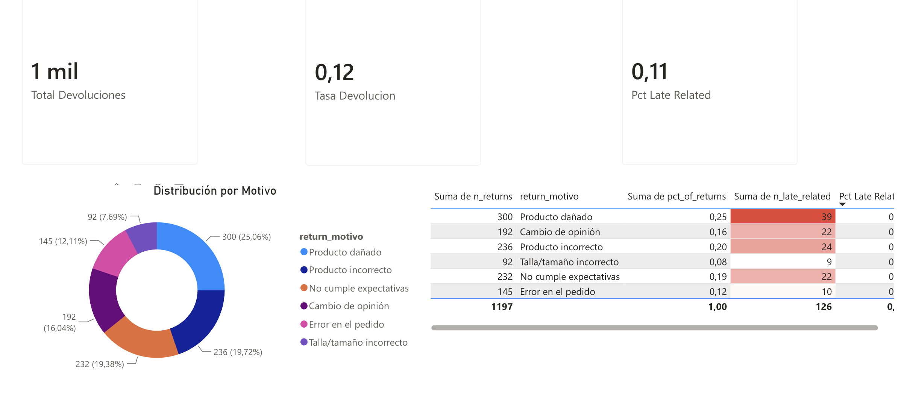
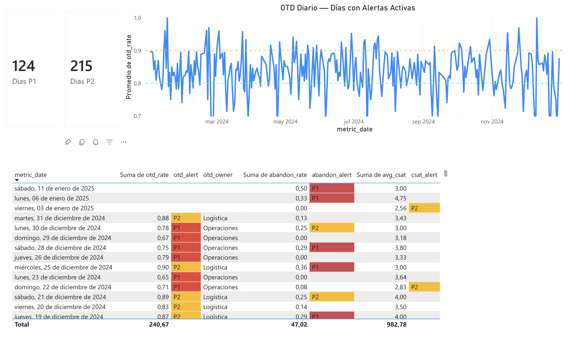

# Retail Postventa Analytics


Analítica end-to-end de postventa para e-commerce retail LATAM (inspirado en Lider.cl / Walmart Chile).
Pipeline completo desde generación de datos sintéticos hasta dashboards ejecutivos, con estándares de ingeniería de producción.

---

## Pregunta de negocio

> **¿Cuántos contactos genera cada orden de e-commerce, por qué motivos, y cómo podemos predecir y reducir los contactos evitables?**

---

## Dashboard Power BI

[Ver dashboard en vivo](https://app.powerbi.com/view?r=eyJrIjoiYTNkNThlNzItZGRiZC00ZjNkLThiMDgtMTI0Nzc5M2Q2OTU1IiwidCI6ImM2ZTU0OWIzLTVmNDUtNDAzMi1hYWU5LWQ0MjQ0ZGM1YjJjNCJ9&pageName=6e17a280a66aa9e7942b)

**Página 3 — Impacto del atraso (insight estrella)**



**Página 4 — Devoluciones por motivo**



**Página 5 — Alertas diarias P1/P2**



---

## ⭐ Insight estrella

Las órdenes que llegan con atraso generan contacto al postventa **2.4× más** que las entregadas en tiempo:

| Entrega | Órdenes | Con contacto | Tasa de contacto |
|---|---:|---:|---:|
| En tiempo | 8,581 | 2,454 | **28.6%** |
| Atrasada | 1,419 | 960 | **67.6%** |

**Implicancia operativa:** cada punto porcentual de mejora en OTD evita ~400 contactos al año (escala 10K órdenes). Prevenir un retraso equivale a prevenir dos llamadas al contact center.

---

## Arquitectura

```
Generadores Python          BigQuery                    dbt                     Dashboards
─────────────────    ──────────────────────    ──────────────────────    ──────────────────────
                      retail_postventa         retail_postventa           Looker Studio
  orders.py    ─→    ┌─ raw_orders      ─→    ┌─ stg_orders      ─→    ┌─ Resumen ejecutivo
  shipments.py ─→    ├─ raw_shipments   ─→    ├─ stg_shipments   ─→    ├─ Insight OTD↔CPO
  contacts.py  ─→    ├─ raw_contacts    ─→    ├─ stg_contacts    ─→    ├─ Contact Center KPIs
  returns.py   ─→    ├─ raw_returns     ─→    ├─ stg_returns     ─→    └─ Alertas diarias
  surveys.py   ─→    └─ raw_surveys     ─→    └─ stg_surveys
                                               │
                      retail_postventa_dimensional      Power BI
                       ├─ dim_clientes          ─→    ┌─ Resumen ejecutivo
                       ├─ dim_productos         ─→    ├─ Impacto del atraso
                       ├─ dim_carriers          ─→    ├─ Contact Center
                       ├─ fct_orders            ─→    ├─ Devoluciones
                       └─ fct_contacts          ─→    └─ Alertas
                      │
                      retail_postventa_marts
                       ├─ mart_cpo_semanal
                       ├─ mart_cpo_por_motivo
                       ├─ mart_otd_vs_sla
                       ├─ mart_correlacion_otd_cpo   ← insight estrella
                       ├─ mart_devoluciones_motivo
                       ├─ mart_kpis_contact_center
                       └─ mart_alerts_diarias
```

---

## Stack técnico

| Capa | Tecnología | Decisión |
|---|---|---|
| Lenguaje | Python 3.11 | Type hints + mypy strict |
| Gestor de paquetes | **uv** | Reproducibilidad exacta con uv.lock |
| Datos sintéticos | numpy + pandas | Seeds reproducibles (seed=42) |
| Storage | **BigQuery** | Dataset gratuito para portafolio |
| Transformación | **dbt-bigquery 1.11** | 17 modelos, 90 tests |
| Visualización | **Looker Studio + Power BI** | Dos herramientas enterprise |
| Lint + formato | Ruff | Reemplaza flake8 + black + isort |
| Type check | mypy strict | Cobertura completa de tipos |
| Tests | pytest | 41 tests (generators + ML) |
| Hooks | pre-commit | Ruff + mypy en cada commit |
| CI/CD | GitHub Actions | Push a main dispara pipeline |

---

## Datos sintéticos

10,000 órdenes generadas para el año 2024, calibradas para reproducir comportamientos reales de e-commerce LATAM:

| Archivo | Filas | Descripción |
|---|---:|---|
| `orders.csv` | 10,000 | Órdenes con cliente, región, producto, monto |
| `shipments.csv` | 10,000 | Despachos con carrier, fechas prometidas y reales |
| `contacts.csv` | 3,414 | Contactos postventa (CPO = 0.341) |
| `returns.csv` | 1,197 | Devoluciones (tasa = 12%) |
| `surveys.csv` | 1,758 | Encuestas post-contacto (tasa = 60%) |

**Reglas de coherencia embebidas:**
- `contact_date` siempre posterior a `actual_delivery_date`
- Contactos abandonados tienen `agent_id`, `aht`, `csat`, `fcr` en NULL
- Encuestas solo para contactos no abandonados
- Carriers con mayor late rate histórico generan más contactos

---

## Modelo dbt (90 tests, 0 errores)

```
staging (views)           dimensional (tables)        marts (tables)
──────────────────        ────────────────────        ───────────────────────────
stg_orders                dim_clientes (2,800)        mart_cpo_semanal
stg_shipments             dim_productos (15)          mart_cpo_por_motivo
stg_contacts       ─→     dim_carriers (5)     ─→    mart_otd_vs_sla
stg_returns               fct_orders (10,000)         mart_correlacion_otd_cpo ⭐
stg_surveys               fct_contacts (3,414)        mart_devoluciones_motivo
                                                      mart_kpis_contact_center
                                                      mart_alerts_diarias
```

Tests por capa: `unique`, `not_null`, `relationships`, `accepted_values`.

---

## KPIs monitoreados

| KPI | Valor 2024 | Target |
|---|---|---|
| CPO (Contacts Per Order) | 0.341 | < 0.30 |
| OTD (On-Time Delivery) | 85.8% | ≥ 90% |
| FCR (First Contact Resolution) | 68% | ≥ 70% |
| Abandon Rate | 15% | < 12% |
| CSAT promedio | ~3.5 / 5 | ≥ 4.0 |
| Tasa de devolución | 12% | < 10% |

---

## Estructura del repositorio

```
retail-postventa-analytics/
├── config/
│   └── settings.py          # Catálogos de negocio (única fuente de verdad)
├── data_gen/
│   ├── generar_orders.py
│   ├── generar_shipments.py
│   ├── generar_contacts.py
│   ├── generar_returns.py
│   └── generar_surveys.py
├── scripts/
│   └── load_to_bigquery.py  # Carga idempotente a BigQuery raw
├── dbt_project/
│   └── models/
│       ├── staging/          # 5 modelos stg_*
│       ├── dimensions/       # 3 modelos dim_*
│       ├── facts/            # 2 modelos fct_*
│       └── marts/            # 7 modelos mart_*
├── dashboards/
│   ├── looker/spec.md        # Especificación completa Looker Studio
│   └── powerbi/spec.md       # Especificación completa Power BI
├── ml/
│   └── predict_contact.py    # Regresión logística P(contacto | orden), ROC-AUC 0.94
├── docs/
│   ├── insights.md           # Análisis del insight estrella OTD↔CPO
│   └── ml_results.md         # Resultados del modelo predictivo
└── tests/
    ├── test_setup.py
    ├── test_settings.py
    └── test_generadores.py   # 35 tests (orders, shipments, contacts, returns, surveys)
```

---

## Setup y reproducción

### Requisitos previos

- Python 3.11+
- [uv](https://docs.astral.sh/uv/) — gestor de paquetes
- Cuenta GCP con BigQuery habilitado
- `gcloud auth application-default login`

### Instalación

```bash
git clone https://github.com/JulioPradenas/retail-postventa-analytics.git
cd retail-postventa-analytics
uv sync
```

### Variables de entorno

```bash
export GCP_PROJECT_ID=<tu-proyecto-bq>
export GCP_BQ_DATASET=retail_postventa
export PYTHONPATH=.
```

### Ejecutar el pipeline completo

```bash
# 1. Generar datos sintéticos
PYTHONPATH=. uv run python data_gen/generar_orders.py
PYTHONPATH=. uv run python data_gen/generar_shipments.py
PYTHONPATH=. uv run python data_gen/generar_contacts.py
PYTHONPATH=. uv run python data_gen/generar_returns.py
PYTHONPATH=. uv run python data_gen/generar_surveys.py

# 2. Cargar a BigQuery
uv run python scripts/load_to_bigquery.py

# 3. Ejecutar modelos dbt
cd dbt_project && dbt run && dbt test
```

### Calidad de código

```bash
uv run ruff check .       # Lint
uv run ruff format .      # Formato
uv run mypy .             # Type check
uv run pytest             # 35 tests
```

---

## Estado del proyecto

| Módulo | Descripción | Estado |
|---|---|---|
| M0 | Setup base + tooling | ✅ Completo |
| M1 | Generadores de datos sintéticos | ✅ Completo |
| M2 | Carga a BigQuery raw | ✅ Completo |
| M3 | dbt staging (5 modelos, 33 tests) | ✅ Completo |
| M4 | dbt dimensional (5 modelos, 30 tests) | ✅ Completo |
| M5 | dbt marts KPIs (7 modelos, 27 tests) | ✅ Completo |
| M6 | Dashboards Looker Studio + Power BI | ✅ Completo |
| M7 | Modelo predictivo (regresión logística) | ✅ Completo |
| M8 | Orquestación con Airflow local | 🔜 Post-MVP |

---

## Autor

**Julio Prad** — Data Analyst  
[GitHub](https://github.com/JulioPradenas)
